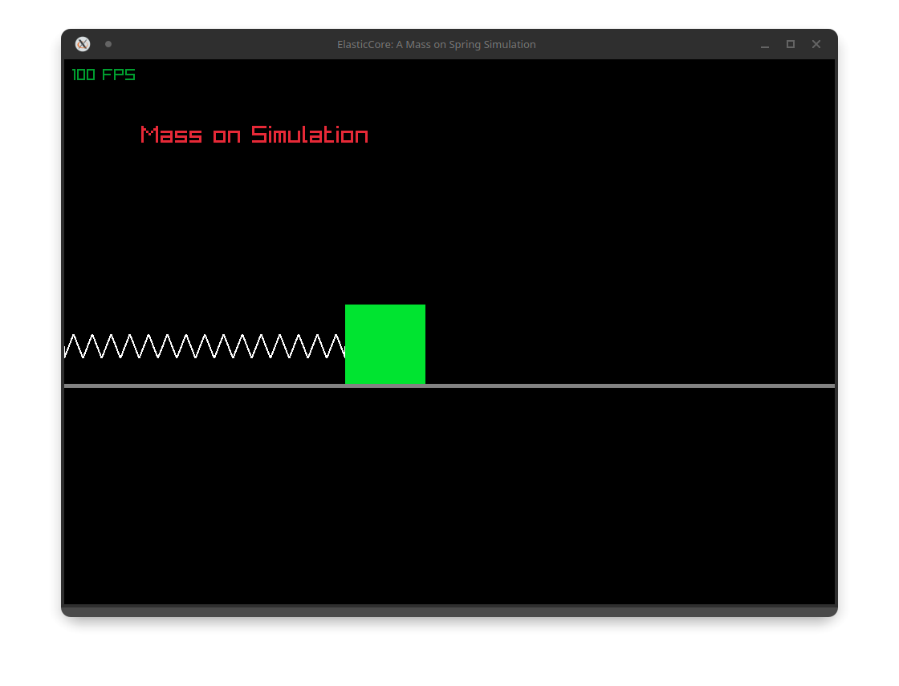

# Spring Mass Simulation

A real-time physics-based spring-mass visualization built with C and Raylib.



## Table of Contents

- [About](#about)
- [Features](#features)
- [Getting Started](#getting-started)
  - [Prerequisites](#prerequisites)
  - [Installation](#installation)
  - [Building from Source](#building-from-source)
- [Usage](#usage)
- [Configuration](#configuration)
- [Technical Overview](#technical-overview)
- [Roadmap](#roadmap)
- [Contributing](#contributing)
- [License](#license)
- [Acknowledgments](#acknowledgments)

## About

Spring Mass Simulation is an educational physics visualization tool that demonstrates the mechanics of a mass connected to a fixed anchor point via a spring. The simulation renders a dynamic zigzag spring pattern that stretches and compresses as the mass moves along a horizontal surface.

This project serves as both a learning resource for physics concepts and a reference implementation for game development techniques using Raylib.

## Features

- Real-time spring visualization with dynamic coil deformation
- Zigzag spring pattern using perpendicular vector calculations
- Smooth 120 FPS animation
- Minimal dependencies and clean codebase
- Cross-platform support (Windows, Linux, macOS)
- Configurable simulation parameters

## Getting Started

### Prerequisites

**For Pre-built Windows Executable:**
- Windows 10 or 11 (64-bit)
- No additional software required

**For Building from Source:**
- C compiler (GCC, Clang, or MSVC)
- Raylib 4.x or 5.x
- Make (optional)

### Installation

**Windows (Pre-built):**

1. Download `spring_simulation.exe` from the [Releases](../../releases) page
2. Run the executable - no installation required

**Linux (Package Manager):**

```bash
# Install Raylib (Debian/Ubuntu)
sudo apt install libraylib-dev

# Install Raylib (Fedora)
sudo dnf install raylib-devel

# Install Raylib (Arch)
sudo pacman -S raylib
```

**macOS (Homebrew):**

```bash
brew install raylib
```

### Building from Source

Clone the repository:

```bash
git clone https://github.com/yourusername/spring-mass-simulation.git
cd spring-mass-simulation
```

**Linux:**

```bash
gcc spring.c -o spring_simulation -lraylib -lGL -lm -lpthread -ldl -lrt -lX11
```

**macOS:**

```bash
gcc spring.c -o spring_simulation -lraylib -framework Cocoa -framework IOKit -framework OpenGL
```

**Windows (MinGW):**

```bash
gcc spring.c -o spring_simulation.exe -lraylib -lopengl32 -lgdi32 -lwinmm
```

**Windows (MSVC):**

```bash
cl spring.c raylib.lib /I"path\to\raylib\include" /link /LIBPATH:"path\to\raylib\lib"
```

## Usage

Run the compiled executable:

```bash
# Linux/macOS
./spring_simulation

# Windows
spring_simulation.exe
```

The simulation starts automatically. The mass moves horizontally while the spring dynamically adjusts its shape. Close the window to exit.

## Configuration

Adjust these constants in `spring.c` to customize the simulation:

| Constant | Default | Description |
|----------|---------|-------------|
| `FPS` | 120 | Target frames per second |
| `WIDTH` | 960 | Window width in pixels |
| `HEIGHT` | 680 | Window height in pixels |
| `SPRING_LEN` | 8 | Number of spring coil segments |
| `SPRING_THICKNESS` | 2 | Spring line thickness in pixels |
| `SPRING_ELASTICITY` | 60 | Spring coil width offset |
| `MASS_LENGTH` | 100 | Size of the mass block in pixels |
| `FLOOR_Y` | 60% height | Y-position of the floor |

## Technical Overview

### Spring Rendering Algorithm

The spring uses a vector-based zigzag algorithm:

1. **Direction Vector**: Calculate normalized vector from anchor to mass
2. **Perpendicular Vector**: Rotate direction 90 degrees for offset direction
3. **Segment Positioning**: Place each segment along the spring axis
4. **Alternating Offset**: Apply perpendicular offset, alternating left/right
5. **Line Drawing**: Connect segments to form the coil pattern

```
Anchor
   |
   +--+
      |
   +--+
   |
   +--+
      |
  [Mass]
```

### File Structure

```
spring-mass-simulation/
├── spring.c          # Main source code
├── README.md         # This file
├── RELEASE.md        # Release notes
├── image.png         # Screenshot
├── .gitignore        # Git ignore rules
└── raylib/           # Raylib source (optional)
```

## Roadmap

- [ ] Implement Hooke's Law for physics-based motion
- [ ] Add user interaction (drag and release mass)
- [ ] Implement damping and friction
- [ ] Add multiple spring-mass configurations
- [ ] Create UI controls for parameters
- [ ] Add force vector visualization
- [ ] Implement vertical pendulum mode
- [ ] Export simulation data

See the [open issues](../../issues) for a full list of proposed features and known issues.

## Contributing

Contributions are welcome and appreciated.

1. Fork the repository
2. Create your feature branch (`git checkout -b feature/new-feature`)
3. Commit your changes (`git commit -m 'Add new feature'`)
4. Push to the branch (`git push origin feature/new-feature`)
5. Open a Pull Request

Please ensure your code follows the existing style and includes appropriate comments.

## License

This project is provided as-is for educational purposes. See the [LICENSE](LICENSE) file for details.

## Acknowledgments

- [Raylib](https://www.raylib.com/) - Simple and easy-to-use game development library
- [Ramon Santamaria](https://github.com/raysan5) - Creator of Raylib
